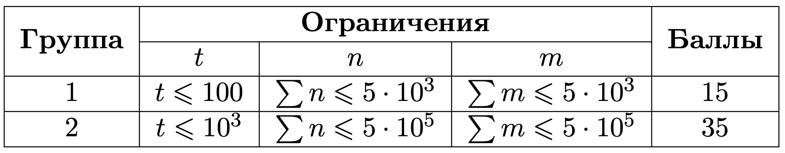

# Условие задачи

Имеется **n** заказов. Все заказы идентичны и занимают одинаковое пространство. Известно, что **i**-й заказ прибудет в пункт сортировки ровно в момент времени **arrival[i]**. Все значения **arrival[i]** различны.

Также есть **m** грузовых машин. У каждой машины **j** есть:

- Время начала погрузки товаров **start[j]**.
- Время выезда с порта погрузки **end[j]**.
- Количество вмещаемых заказов **capacity[j]**.

Необходимо определить для каждого заказа **i**, в какую грузовую машину он попадёт.

### Правила попадания заказа в машину:
1. Заказ попадает в машину, которая находится в пункте сортировки в момент прибытия заказа. То есть, если **start[j] <= arrival[i] <= end[j]**, то машина **j** может взять заказ **i**.

2. Если в один и тот же момент времени в пункте сортировки находится несколько машин, то заказ попадает в ту машину, которая приехала раньше. То есть, выбирается машина с минимальным значением **start[j]**.

3. Если несколько машин имеют одинаковое время **start[j]**, то выбирается та машина, у которой индекс **j** минимален.

4. В машине не может быть больше, чем **capacity[j]** заказов. Следовательно, если машина загружена, заказ попадает в следующую машину, которая также удовлетворяет условиям выше.

### Задача:
Для каждого заказа необходимо вывести, в какую грузовую машину он попадёт. Если заказ не может быть принят ни одной машиной, то для него выводится **-1**.

# Входные данные

Каждый тест состоит из нескольких наборов входных данных.

### Структура входных данных:

1. Первая строка содержит целое число **t** (1 ≤ t ≤ 1000) — количество наборов входных данных.

2. Далее следует описание наборов входных данных.

    1. Первая строка каждого набора входных данных содержит целое число **n** (1 ≤ n ≤ 5 ⋅ 10⁵) — количество заказов.

    2. Вторая строка каждого набора входных данных содержит **n** целых чисел **arrival[i]** (1 ≤ arrival[i] ≤ 10⁹), разделённых пробелом — массив **arrival**.

    3. Третья строка содержит целое число **m** (1 ≤ m ≤ 5 ⋅ 10⁵) — количество грузовых машин.

    4. Далее следует **m** строк, каждая из которых содержит три целых числа:

        - **start[j]** — время начала погрузки товаров (1 ≤ start[j] ≤ end[j] ≤ 1e9),
        - **end[j]** — время выезда с порта погрузки (1 ≤ start[j] ≤ end[j] ≤ 1e9),
        - **capacity[j]** — количество вмещаемых заказов для машины **j** (1 ≤ capacity[j] ≤ n).

### Гарантии:

- Гарантируется, что сумма значений **n** и **m** по всем наборам входных данных не превышает **5 ⋅ 10⁵**.
  

# Выходные данные

Для каждого набора входных данных выведите одну строку.

Строка должна содержать ответ на задачу — для каждого заказа **i** это номер машины, которая будет перевозить заказ.

- Выведите **-1**, если:
    - Время прибытия заказа в пункт сортировки не попадает ни в один из временных интервалов, когда идёт загрузка в машины;
    - Во время доставки заказа в пункт сортировки все машины полностью загружены.


# Пример теста 1
#### Входные данные
```
3
5
1 9 2 6 4
3
1 8 3
3 10 1
4 7 4
5
1 9 2 6 4
3
1 8 3
3 10 2
4 7 4
8
100 37 19 2 46 4 15 88
4
27 80 1
1 46 2
41 83 1
1 75 2
```

#### Выходные данные

```
1 -1 1 2 1
1 2 1 2 1
-1 1 4 2 3 2 4 -1
```   